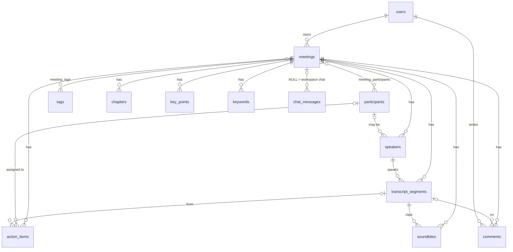

# Fireflies.ai Clone: Meeting Notes & Transcripts

A functional clone of the Fireflies.ai meeting assistant for the SDE Fullstack assignment: a meetings library, interactive transcripts with a seekable player, AI-style summaries and action items, full CRUD, and the Fireflies workspace chrome (sidebar, Ctrl+K search, capture menu, modals, toasts, settings, dark/light theme).

- **Live demo:** https://fireflies-clone-one-virid.vercel.app
- **API docs (Swagger):** https://fireflies-api-es2t.onrender.com/docs

Real speech-to-text, live bots, integrations, teams and authentication are out of scope. Those screens are present and say **Coming soon** (see [Placeholders](#placeholders)).

## Tech stack

| Layer | Choice |
|---|---|
| Frontend | Next.js 14 (App Router), TypeScript, Tailwind CSS, lucide-react, react-hot-toast |
| Backend | Python 3, FastAPI, SQLAlchemy 2, Pydantic 2 |
| Database | SQLite (own schema, 15 tables, foreign keys enforced) |
| PDF export | fpdf2 |
| Optional LLM | Anthropic Messages API via `httpx`, only if `ANTHROPIC_API_KEY` is set |
| Tests | pytest (API), Playwright (browser end-to-end) |

## Quick start

Prerequisites: Python 3 and Node 18+ (developed and tested on Python 3.12 and Node 22).

```bash
# 1. Backend  (http://localhost:8000, docs at /docs)
cd backend
python -m venv .venv && source .venv/bin/activate      # Windows: .venv\Scripts\activate
pip install -r requirements.txt
python -m uvicorn app.main:app --reload --port 8000     # creates and seeds fireflies.db on first boot

# 2. Frontend  (http://localhost:3000), in a second terminal
cd frontend
npm install
npm run dev
```

On Windows, `run.bat` or `run.ps1` does both steps. The frontend talks to `http://localhost:8000/api` by default; override with `NEXT_PUBLIC_API_URL`.

Useful commands:

```bash
cd backend && python -m pytest -q                 # 15API tests
cd backend && python -m app.seed.run --reset      # wipe and re-seed the database
cd frontend && npx tsc --noEmit && npm run build  # typecheck + production build
# browser tests (need `pip install playwright && playwright install chromium`, both servers running,
# with the frontend built and served by `npx next start -p 3000`):
python e2e/smoke_test.py && python e2e/m4_test.py
```

## What is implemented

| Assignment area | Where it lives |
|---|---|
| **Meetings library**: list with title, date, duration, participants; search by title/transcript, filter by participant, date range, tag; sort by recency, duration or title | `/meetings`, `/` (Home) |
| **Meeting detail**: transcript with speaker labels and timestamps, player with seek bar (±10s, speed), click a line to seek and the reverse, in-transcript search with highlights, match counter and next/previous (regex-safe) | `/meetings/[id]` |
| **AI summary and notes**: overview, action items with assignee and due date, outline/chapters, key points, keywords | Summary, Action items and Outline tabs |
| **CRUD**: create by uploading `.txt/.vtt/.srt/.json` or pasting a transcript; edit title and participants; delete (cascades); add, edit, complete and delete action items; everything persists in SQLite | `/uploads`, meeting page, `/tasks` |
| **Fireflies experience**: sidebar (full or rail), topbar, profile menu, notifications, help button, Capture split-button and modals, toasts, settings, plan page | app shell, `/settings`, `/upgrade` |
| **Bonus**: comments and soundbites on transcript lines; export to Markdown, TXT and PDF; global search (Ctrl+K); tags; Ask Fred chat; dark, light and system themes | throughout |
| **Responsive layout**: sidebar becomes an off-canvas drawer with a hamburger toggle below the `md` breakpoint; compact top bar, adaptive player controls, stacked settings | app shell, `/settings`, `/meetings/[id]` |
| **Transcript parsing**: speakers detected from `Name: text` and `Name - text` lines; action items extracted from "I will…", "Name will…", "we need to…", "X has to…" and short tasks like "I will mail you", with assignee and due-date parsing | `services/transcript_parser`, `services/notes_engine` |
The player is **simulated** (a clock) unless a meeting has a `media_url`, in which case a real `<audio>` element is used. The UI labels it "Sample playback".

## Architecture

```
Browser (Next.js, port 3000)
   │  fetch JSON  (lib/api.ts is the only place that knows the URLs)
   ▼
FastAPI (port 8000)
   routers/        HTTP only: validation, status codes     meetings.py, library.py
   services/       business logic, no HTTP                 meeting_service, notes_engine,
                                                           transcript_parser, ask_fred,
                                                           exporter, llm (optional)
   models.py       SQLAlchemy tables      schemas.py  Pydantic request/response models
   database.py     engine, FK pragma ON, UTC datetime type
   ▼
SQLite file (backend/fireflies.db)
```

```
frontend/src
  app/           routes: /, /meetings, /meetings/[id], /uploads, /tasks, /askfred, /settings, /upgrade, ...
  components/    shell/ (sidebar, topbar, modals)  meeting/ (player, transcript, tabs)
                 meetings/  askfred/  settings/  ui/ (Modal, Avatar, Md, Highlight, ComingSoon)
  lib/           api.ts, types.ts, app-context.tsx (theme, modals, toasts), hooks, usePlayer, useChat, settings
```

Design decisions worth knowing:

- **Notes pipeline.** Creating a meeting runs `transcript_parser` (handles transcripts with or without speakers and timestamps; estimates timing at 2.6 words per second when missing) and then `notes_engine`, a deterministic generator. It produces keywords, topic-segmented chapters, key points, action items (assignee and due-date parsing) and an overview. If `ANTHROPIC_API_KEY` is set, `llm.py` is used instead, and it falls back to the local engine on any failure, so the app always works offline.
- **Ask Fred** answers only from stored data: intent detection plus keyword retrieval over transcripts by default, Claude if a key is set. Answers list their source meetings. History is persisted per meeting, plus one workspace-wide thread.
- **Time zones.** Datetimes are stored as UTC and always serialised with a `Z`, so the browser never shifts them.
- **Seed data** is dated relative to first boot ("2 days ago"), so the library always looks current.
- **Speaker detection.** A `Name - text` dash line is treated as a speaker label only when most lines in the transcript use that format, so ordinary sentences such as "Well - I think so" are not misread as speakers.
- **Action-item heuristics.** The notes engine is rule-based, not a real AI model, so not every sentence will produce an action item. For the most reliable results, use `Name: text` lines or timestamps. Set `ANTHROPIC_API_KEY` for LLM-based extraction.
- **Regenerate notes.** `POST /meetings/{id}/regenerate-notes` re-runs the notes pipeline but keeps the existing speaker names. To re-detect speakers, delete the meeting and upload the transcript again.

## Database schema



- **15 tables**, normalised. Many-to-many links (`meeting_participants`, `meeting_tags`) use composite primary keys, so duplicates are impossible.
- Child tables use `ON DELETE CASCADE`, and `PRAGMA foreign_keys=ON` is set on every connection (SQLite ignores foreign keys otherwise). A test verifies that deleting a meeting removes everything beneath it.
- AI notes (chapters, key points, keywords) are separate tables rather than a JSON blob, so they can be queried and edited individually.
- `action_items.due_date` is a real `DATE`; timestamps use a UTC-aware type; frequent filters are indexed (`meetings.date`, `owner_id`, `participants.name`, `tags.name`).
- `chat_messages.meeting_id` is nullable: `NULL` means the workspace-wide Ask Fred thread.

## API overview

Base path `/api`. Full interactive documentation is at `/docs`.

| Method and path | Purpose |
|---|---|
| `GET /meetings` | List. Query: `q`, `participant`, `tag`, `date_range` (today, week, month, quarter), `date_from`, `date_to`, `sort_by` (recency, duration, title), `order` |
| `POST /meetings` | Create from JSON (title, participants, tags, `transcript_text`) |
| `POST /meetings/upload` | Create from a `.txt/.vtt/.srt/.json` file (multipart, 5 MB max) |
| `GET /meetings/{id}` | Detail: segments, chapters, key points, keywords, action items, comments, soundbites |
| `PATCH /meetings/{id}` | Edit title, participants, tags, overview |
| `DELETE /meetings/{id}` | Delete (204, cascades) |
| `POST /meetings/{id}/regenerate-notes` | Re-run the notes pipeline |
| `POST /meetings/{id}/action-items` | Add an action item |
| `PATCH` / `DELETE /action-items/{id}` | Edit, complete or remove an action item |
| `POST /meetings/{id}/comments`, `DELETE /comments/{id}` | Comments (optionally on a segment) |
| `POST /meetings/{id}/soundbites`, `DELETE /soundbites/{id}` | Save or remove a soundbite |
| `POST /meetings/{id}/tags` | Add a tag |
| `GET`, `POST`, `DELETE /meetings/{id}/chat` | Ask Fred for one meeting |
| `GET`, `POST`, `DELETE /chat` | Workspace-wide Ask Fred |
| `GET /meetings/{id}/export?format=md\|txt\|pdf` | Download a meeting |
| `GET /search?q=` | Global search across titles, summaries and transcript lines |
| `GET /tasks`, `/tags`, `/participants`, `/me`, `/health` | Supporting data |

Errors are JSON `{"detail": ...}` with standard status codes (404 missing, 422 validation, 413 oversize upload).

## Assumptions

- A single default user is always logged in (`DEFAULT_USER_NAME` / `DEFAULT_USER_EMAIL`); there are no accounts or sessions.
- Transcripts are provided, not produced. Accepted formats: `.txt` (`Speaker: text`, optional timestamps), `.vtt`, `.srt`, `.json`.
- Summaries and action items are generated heuristically from the transcript. They are good, not perfect; regenerate or edit as needed.
- Settings and theme preferences are stored in the browser (`localStorage`), not the database.
- The Free plan figures (3 free meetings, 400 minutes of storage) are display values copied from the reference UI, not enforced limits.

## Placeholders

Per the assignment, these show "Coming soon" and do nothing real: live bot and Capture/Schedule/Record flows, speech-to-text, integrations and AskFred connectors (browsable catalogues only), AI Skills, Analytics, Voice Agents, Email Assistant, teams and sharing, billing/upgrade buttons, and real authentication. Account deletion and leaving a team are shown but deliberately inert.

## Deployment

**Backend (Render, Railway or any container host).** Root directory `backend`. A `render.yaml` blueprint and `Procfile` are included.

- Build: `pip install -r requirements.txt`
- Start: `uvicorn app.main:app --host 0.0.0.0 --port $PORT`
- Environment: `CORS_ORIGINS=https://<your-frontend-domain>` (comma-separated; the default `*` is fine for a demo), optional `ANTHROPIC_API_KEY`.

**Frontend (Vercel or Netlify).** Root directory `frontend`, framework Next.js. Set `NEXT_PUBLIC_API_URL=https://<your-backend-domain>/api` **before building**: `NEXT_PUBLIC_*` values are baked in at build time, so changing it requires a redeploy.

**Persistence caveat.** SQLite lives in a file. On hosts with an ephemeral disk (such as Render's free tier), data created in the demo resets whenever the service restarts or redeploys. The app re-seeds itself on an empty database, so it always comes up usable. For durable data, attach a persistent disk and set `DATABASE_URL=sqlite:////data/fireflies.db`.

## Testing

- `backend/tests/test_api.py`: 15 API tests, including regression tests for dash-separated speaker lines and obligation-style action items. search/filter/sort, detail payload, create-from-paste and CRUD, upload formats, comments/soundbites/chat/search/export, cascade deletes, validation, and the notes engine on empty input.
- `e2e/smoke_test.py` (24 checks) and `e2e/m4_test.py` (44 checks): Playwright runs through the library, filters, transcript seek and search, action-item CRUD, create-by-paste, delete, Ask Fred, settings persistence, plan page, integrations, and the Coming soon pages.

## Known limitations

- Speech-to-text is not implemented; transcripts are seeded, pasted or uploaded.
- Summaries and action items are heuristic (see Design decisions) and may miss some phrasing.
- On free hosting the SQLite file is ephemeral: meetings created in the demo may reset after a restart or redeploy. The app re-seeds on an empty database.
- The media player is simulated unless a meeting has a `media_url`.
